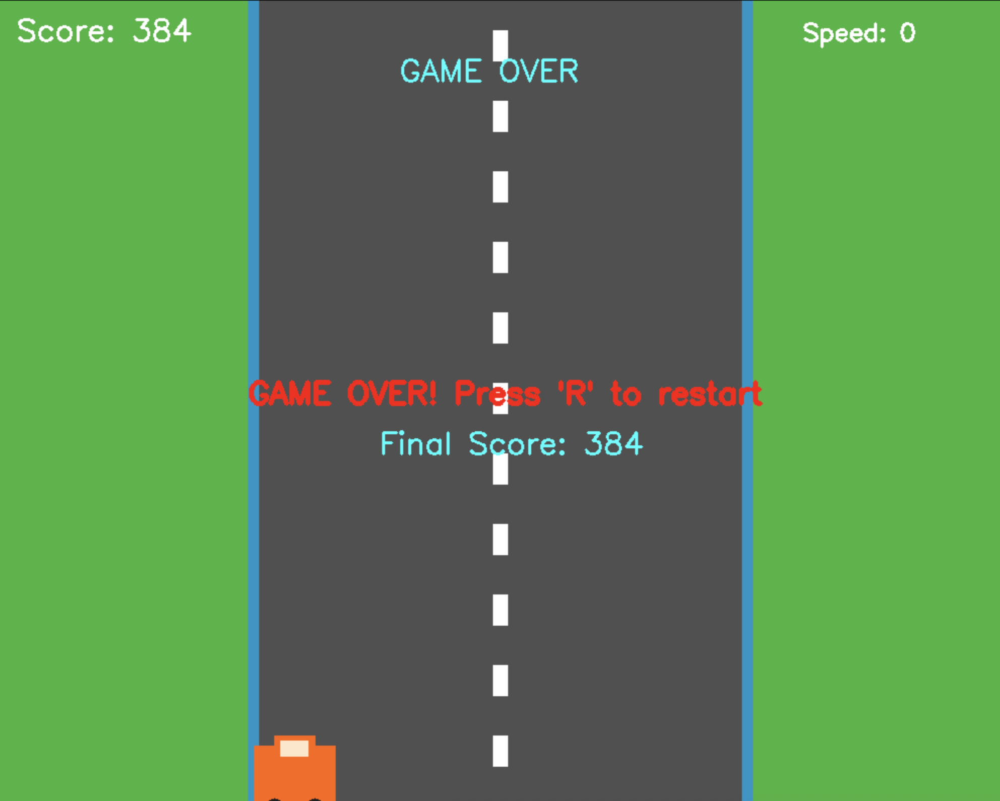
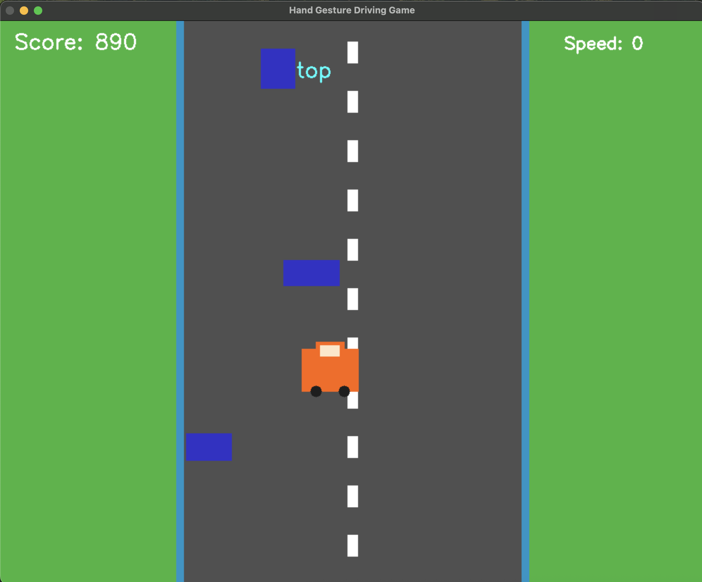

# Hand Gesture Controlled Vehicle Driving Game

This project is a **hand gesture-controlled vehicle driving game** built using **MediaPipe** and **OpenCV**. It detects hand gestures via your webcam and uses them to control a car on a virtual road.

> A fun entry into the world of Computer Vision and Gesture Recognition!

---

## Hand Controls

- **Both Palms Open** → Move Forward
- **Both Fists** → Move Backward
- **Left Palm + Right Fist** → Turn Left
- **Right Palm + Left Fist** → Turn Right
- **Press 'Q'** → Quit the game
- **Press 'R'** → Restart when game is over

---

## Stacks Used

- Python 3
- OpenCV
- MediaPipe (for hand tracking)
- NumPy

---

## Screenshots

| Gameplay                                 | Gesture Detection                       |
| ---------------------------------------- | --------------------------------------- |
|  |  |

---

## Setup Instructions

1. **Clone this repository**

   ```bash
   git clone https://github.com/kapalikkhanal/Hand-Gesture-Game.git
   cd Hand-Gesture-Game

   ```

2. **Create a virtual environment (optional but recommended)**

   ```bash
    python -m venv venv
    source venv/bin/activate  # on macOS/Linux
    venv\Scripts\activate     # on Windows

   ```

3. **Install dependencies**

   ```bash
    pip install -r requirements.txt

   ```

3. **Run the game**

   ```bash
    python main.py

   ```

## License

This project is open-source and available under the MIT License.